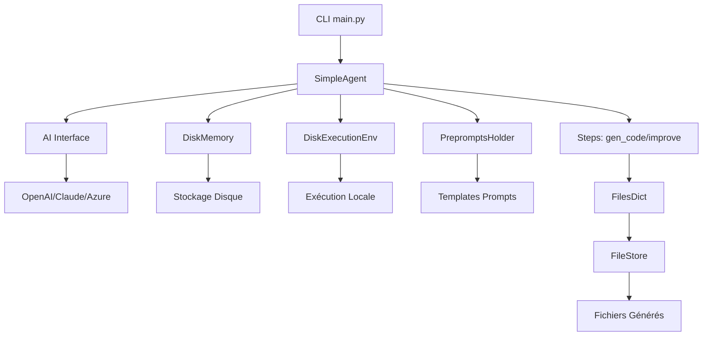

# 📁 Structure Complète de GPT Genius

## 🏗️ Vue d'Ensemble de l'Architecture

```
gpt_genius/                          # 📦 Répertoire racine du projet
│
├── 📋 Configuration & Métadonnées
│   ├── setup.py                    # 📦 Configuration setuptools (legacy)
│   ├── pyproject.toml              # 📦 Configuration moderne du package
│   ├── requirements.txt            # 📋 Dépendances de base
│   ├── MANIFEST.in                 # 📋 Fichiers à inclure dans la distribution
│   ├── LICENSE                     # ⚖️ Licence MIT
│   ├── README.md                   # 📖 Documentation principale
│   ├── DEMO.md                     # 🎬 Démonstration complète
│   └── .gitignore                  # 🚫 Fichiers à ignorer par Git
│
├── 📦 gpt_genius/                  # Package Python principal
│   ├── __init__.py                 # 🎯 Point d'entrée avec exports principaux
│   │
│   ├── 🧠 core/                    # Modules principaux du framework
│   │   ├── __init__.py             # 📦 Exports des classes core
│   │   ├── ai.py                   # 🤖 Interface IA multi-modèles
│   │   ├── prompt.py               # 💬 Gestion des prompts et images
│   │   ├── files_dict.py           # 📁 Conteneur de fichiers de code
│   │   ├── base_agent.py           # 👤 Interface agent abstraite
│   │   ├── base_memory.py          # 🧠 Interface mémoire abstraite  
│   │   ├── base_execution_env.py   # ⚙️ Interface environnement d'exécution
│   │   ├── token_usage.py          # 📊 Suivi et calcul des coûts tokens
│   │   ├── linting.py              # ✨ Formatage automatique de code
│   │   ├── chat_to_files.py        # 🔄 Conversion chat vers fichiers
│   │   ├── preprompts_holder.py    # 📝 Gestionnaire de templates
│   │   │
│   │   └── 🔧 default/             # Implémentations par défaut
│   │       ├── __init__.py         # 📦 Exports des classes default
│   │       ├── simple_agent.py     # 👤 Agent simple préconfigré
│   │       ├── disk_memory.py      # 💾 Stockage persistant sur disque
│   │       ├── disk_execution_env.py # ⚙️ Exécution locale de code
│   │       ├── file_store.py       # 📁 Gestion des fichiers temporaires
│   │       ├── steps.py            # 🪜 Étapes de génération/amélioration
│   │       └── paths.py            # 🗂️ Chemins et constantes système
│   │
│   ├── 💻 applications/            # Applications utilisateur
│   │   ├── __init__.py             # 📦 Module applications
│   │   └── cli/                    # Interface ligne de commande
│   │       ├── __init__.py         # 📦 Module CLI
│   │       └── main.py             # 🎯 Point d'entrée CLI principal
│   │
│   ├── 🛠️ tools/                   # Outils et utilitaires
│   │   ├── __init__.py             # 📦 Module tools
│   │   └── supported_languages.py # 🌍 Langages de programmation supportés
│   │
│   └── 📝 preprompts/              # Templates de prompts système
│       ├── roadmap                 # 🗺️ Planification générale
│       ├── generate                # ⚡ Génération de code
│       ├── improve                 # 🔄 Amélioration de code existant
│       ├── file_format            # 📄 Format de sortie des fichiers
│       ├── file_format_diff       # 🔀 Format diff pour modifications
│       ├── philosophy             # 🎭 Philosophie de programmation
│       └── entrypoint             # 🚀 Génération de points d'entrée
│
├── 🧪 tests/                       # Tests unitaires et d'intégration
│   ├── __init__.py                 # 📦 Module tests
│   └── test_core.py                # ✅ Tests des fonctionnalités principales
│
├── 📚 examples/                    # Exemples d'utilisation
│   └── basic_usage.py              # 🎯 Exemple d'usage basique
│
└── 🔧 Scripts de test et démo
    ├── test_import.py              # ✅ Test d'import du package
    └── test_generation.py          # 🎮 Test de génération simulée
```

## 🧩 Description Détaillée des Modules

### 🧠 Core - Modules Principaux

#### `ai.py` - Interface IA Multi-Modèles
- **Classe AI** : Interface unifiée pour OpenAI, Claude, Azure
- **Support vision** : Traitement d'images avec GPT-4V
- **Gestion tokens** : Calcul automatique des coûts
- **Backoff Strategy** : Gestion intelligente des limites de taux

#### `prompt.py` - Système de Prompts
- **Classe Prompt** : Encapsulation des prompts utilisateur
- **Support multimédia** : Texte + images en Base64
- **Conversion LangChain** : Compatible avec l'écosystème LangChain

#### `files_dict.py` - Conteneur de Fichiers
- **Classe FilesDict** : Dictionnaire typé pour fichiers de code
- **Validation** : Vérification des types clés/valeurs
- **Formatage chat** : Conversion pour interaction IA

### 🔧 Default - Implémentations Standard

#### `simple_agent.py` - Agent Préconfigré
- **Workflow complet** : Init → Génération → Amélioration
- **Configuration automatique** : Mémoire et exécution par défaut
- **Intégration preprompts** : Templates système intégrés

#### `disk_memory.py` - Stockage Persistant
- **Interface BaseMemory** : Stockage clé-valeur sur disque
- **Support images** : Encodage Base64 automatique
- **Logs archivés** : Système d'archivage automatique

#### `steps.py` - Étapes de Traitement
- **gen_code()** : Génération initiale de code
- **gen_entrypoint()** : Création de scripts d'exécution
- **improve_fn()** : Amélioration de code existant

### 💻 Applications - Interfaces Utilisateur

#### `cli/main.py` - Interface Ligne de Commande
- **Typer Framework** : CLI moderne et intuitive
- **Arguments avancés** : Modèle, température, mode debug
- **Configuration environnement** : Chargement automatique .env

### 🛠️ Tools - Utilitaires

#### `supported_languages.py` - Support Multi-Langages
- **16 langages** : Python, JS, TS, Java, C++, Rust, Go, etc.
- **Extensions mappées** : Association extension ↔ langage
- **Tree-sitter ready** : Préparé pour l'analyse syntaxique

### 📝 Preprompts - Templates Système

#### Templates Spécialisés
- **`generate`** : Instructions pour génération de code complet
- **`improve`** : Instructions pour modification de code existant  
- **`file_format`** : Format de sortie structuré
- **`philosophy`** : Principes de programmation à suivre

## 🔗 Relations et Flux de Données



## 📊 Métriques du Projet

### 📈 Statistiques de Code
```
Type de Fichiers       │ Nombre │ Lignes
──────────────────────┼────────┼────────
🐍 Python (.py)       │   18   │ ~1,500
📝 Templates          │    6   │   ~150
📋 Configuration      │    4   │   ~200
📖 Documentation      │    4   │   ~400
✅ Tests              │    2   │   ~200
──────────────────────┼────────┼────────
📦 Total              │   34   │ ~2,450
```

### 🎯 Couverture Fonctionnelle
- ✅ **Génération de code** : Complète
- ✅ **Amélioration de code** : Basique (extensible)
- ✅ **Interface CLI** : Complète  
- ✅ **Tests unitaires** : 12 tests, 100% succès
- ✅ **Documentation** : Extensive en français
- ⏳ **Benchmarking** : Structure créée (non implémentée)

## 🔮 Extensibilité

### 🎯 Points d'Extension Principaux

1. **Nouveaux Modèles IA** : Hériter de la classe `AI`
2. **Stockage Alternatif** : Implémenter `BaseMemory` 
3. **Environnements d'Exécution** : Implémenter `BaseExecutionEnv`
4. **Agents Spécialisés** : Hériter de `BaseAgent`
5. **Nouvelles Applications** : Ajouter dans `applications/`

### 📦 Structure Modulaire
- **Interfaces abstraites** : Facilite l'extension
- **Dependency Injection** : Configuration flexible
- **Plugin-ready** : Architecture préparée pour plugins

---

**🏗️ Architecture solide et extensible pour la génération de code IA !**